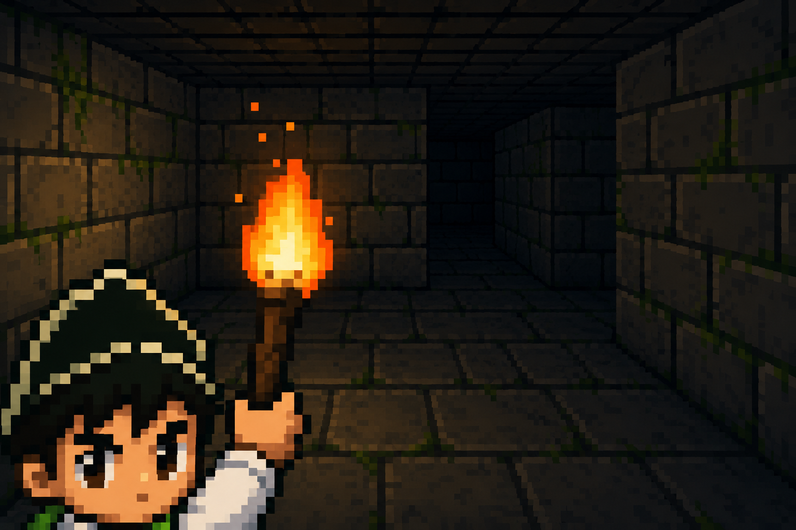

# 🏛️ Labyrinth Origins

<p align="center">
  
</p>

## 📖 Descripción

**Labyrinth Origins** es un videojuego de laberintos desarrollado en **Python** utilizando **Pygame**. El objetivo del jugador es recorrer una serie de laberintos con diferentes temáticas hasta encontrar la salida en el menor tiempo posible.

El proyecto implementa una arquitectura **Cliente-Servidor**, donde múltiples jugadores pueden registrar sus tiempos y competir en un ranking compartido mediante comunicación por sockets TCP.

---

## 🎮 Características

- ✅ 10 niveles con diferentes ambientaciones.
- ✅ Movimiento mediante teclado.
- ✅ Cronómetro en tiempo real.
- ✅ Ranking de jugadores.
- ✅ Arquitectura Cliente-Servidor.
- ✅ Comunicación mediante sockets TCP.
- ✅ Interfaz gráfica desarrollada con Pygame.
- ✅ Música y efectos de sonido.
- ✅ Registro del mejor tiempo.

---

# 🖥️ Tecnologías utilizadas

- Python 3.13
- Pygame
- Python-VLC
- Socket
- Threading

---

# 📂 Estructura del proyecto

```
LabyrinthOrigins
│
├── assets
│   ├── personajes
│   ├── texturas
│   ├── sonidos
│   ├── musica
│   └── mapas
│
├── cliente.py
├── servidor.py
├── jugador.py
├── mapa.py
├── ranking.py
├── README.md
└── requirements.txt
```

---

# ⚙️ Instalación

## 1. Clonar el repositorio

```bash
git clone https://github.com/TU_USUARIO/LabyrinthOrigins.git
```

## 2. Entrar al proyecto

```bash
cd LabyrinthOrigins
```

## 3. Instalar dependencias

```bash
pip install pygame
pip install python-vlc
```

o

```bash
pip install -r requirements.txt
```

---

# ▶️ Ejecución

## Iniciar el servidor

```bash
python servidor.py
```

## Iniciar el cliente

```bash
python cliente.py
```

---

# 🌐 Arquitectura Cliente-Servidor

```
          Cliente 1
               │
               │
          Cliente 2
               │
               │
          Cliente 3
               │
      Socket TCP/IP
               │
        ┌─────────────┐
        │  Servidor   │
        └─────────────┘
               │
        Guarda tiempos
               │
        Actualiza Ranking
```

El servidor administra las conexiones de todos los jugadores, recibe sus tiempos y envía el ranking actualizado a cada cliente conectado.

---

# ⌨️ Controles

| Tecla | Acción |
|-------|--------|
| ⬆️ | Mover arriba |
| ⬇️ | Mover abajo |
| ⬅️ | Mover izquierda |
| ➡️ | Mover derecha |

---

# 🗺️ Niveles

Cada nivel posee una temática diferente para ofrecer variedad visual durante la partida.

| Nivel | Temática |
|--------|----------|
| 1 | Mazmorra |
| 2 | Cementerio |
| 3 | Madera |
| 4 | Cristal |
| 5 | Lava |
| 6 | Hielo |
| 7 | Bosque |
| 8 | Azulejos |
| 9 | Palacio |
| 10 | Psicodélico |

---

# 📸 Capturas del juego

## Menú Principal



---

## Nivel 1


---

## Nivel 2


---

## Nivel 3


---

## Nivel 4


---

## Nivel 5


---

## Nivel 6


---

## Nivel 7


---

## Nivel 8


---

## Nivel 9


---

## Nivel 10


---

# 📈 Funcionamiento

1. El usuario ejecuta el cliente.
2. Se conecta al servidor mediante sockets TCP.
3. Ingresa su nombre.
4. Inicia la partida.
5. Completa el laberinto.
6. El tiempo es enviado al servidor.
7. El servidor actualiza el ranking.
8. El ranking puede ser consultado por todos los jugadores.

---

# 🚀 Posibles mejoras

- Sistema de logros.
- Diferentes personajes.
- Obstáculos dinámicos.
- Enemigos.
- Guardado de partidas.
- Más mapas.
- Cooperativo en línea.
- Chat entre jugadores.

---

# 👨‍💻 Autor

**Andrés Felipe Abril López**
**Joan Sebastian Berbesi Burgos**

---

# 📄 Licencia

Este proyecto fue desarrollado con fines académicos.
